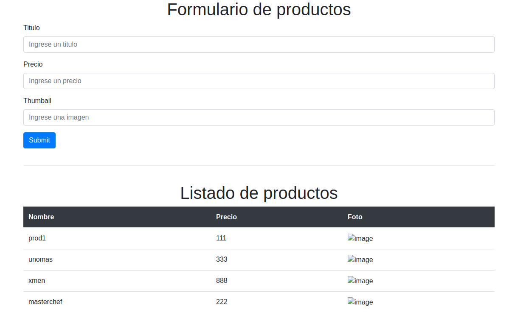

Example App Express with commonjs
=====================================
- [x] modules
- [x] CRUD.
- [x] Handlebars
- [x] socket.io
- [x] chat + store
- [x] faker data
- [x] MongoDB persistence
- [x] Normalizr
- [x] session support mongo,redis,sessiofile
- [x] add support passport login
- [x] add support login facebook

# Sample view

